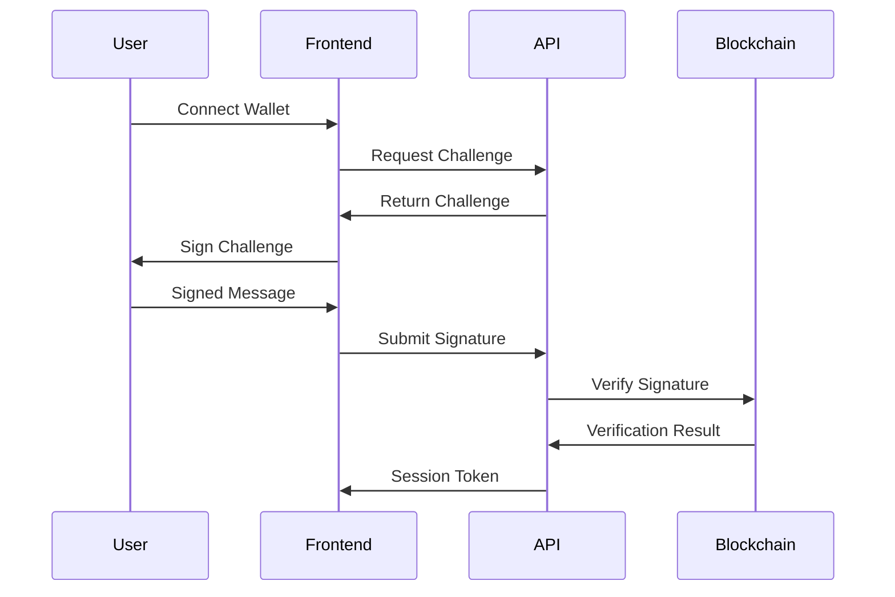
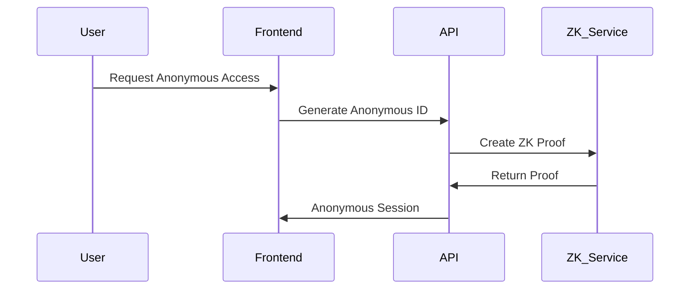

# Authentication Overview

MentalVerse uses a multi-layered authentication system designed for Web3 environments while maintaining the highest security standards for mental health data.

## Authentication Methods

### 1. Wallet-Based Authentication

Primary authentication method using Web3 wallets:

- **Internet Identity** - Native ICP authentication
- **MetaMask** - Ethereum wallet integration
- **Plug Wallet** - ICP-native wallet
- **Stoic Wallet** - ICP wallet with advanced features

### 2. Anonymous Profiles

For users requiring complete anonymity:

- **Zero-Knowledge Proofs** - Verify identity without revealing it
- **Temporary Identities** - Session-based anonymous access
- **Pseudonymous Accounts** - Persistent but anonymous profiles

### 3. Professional Verification

For licensed mental health professionals:

- **Credential Verification** - Automated license validation
- **Multi-Factor Authentication** - Enhanced security requirements
- **Professional Registry** - Blockchain-based credential storage

## Authentication Flow

### Standard User Flow



### Anonymous User Flow



## Security Features

### End-to-End Encryption

- **Message Encryption** - All communications encrypted
- **Key Management** - Decentralized key storage
- **Perfect Forward Secrecy** - Session keys rotated regularly

### Privacy Protection

- **Data Minimization** - Collect only necessary information
- **Pseudonymization** - Replace identifiers with pseudonyms
- **Right to Erasure** - Complete data deletion capabilities

### Audit Trail

- **Immutable Logs** - Blockchain-based audit trails
- **Access Monitoring** - Real-time access tracking
- **Compliance Reporting** - Automated compliance checks

## Token-Based Sessions

### Session Management

```javascript
// Example session token structure
{
  "token": "eyJhbGciOiJIUzI1NiIsInR5cCI6IkpXVCJ9...",
  "expires_at": "2024-01-15T12:00:00Z",
  "permissions": [
    "read:profile",
    "write:messages",
    "join:groups"
  ],
  "user_type": "standard",
  "anonymous": false
}
```

### Token Refresh

```javascript
// Automatic token refresh
const refreshToken = async (currentToken) => {
  const response = await fetch('/api/auth/refresh', {
    method: 'POST',
    headers: {
      'Authorization': `Bearer ${currentToken}`,
      'Content-Type': 'application/json'
    }
  });
  
  return response.json();
};
```

## Implementation Examples

### Frontend Integration

```javascript
import { MentalVerseAuth } from '@mentalverse/sdk';

const auth = new MentalVerseAuth({
  network: 'mainnet', // or 'testnet'
  apiUrl: 'https://api.mentalverse.io/v1'
});

// Connect wallet
const connectWallet = async () => {
  try {
    const session = await auth.connectWallet('internet-identity');
    console.log('Connected:', session.user);
    return session;
  } catch (error) {
    console.error('Connection failed:', error);
  }
};

// Anonymous login
const anonymousLogin = async () => {
  try {
    const session = await auth.createAnonymousSession();
    console.log('Anonymous session created');
    return session;
  } catch (error) {
    console.error('Anonymous login failed:', error);
  }
};
```

### Backend Verification

```javascript
const verifyToken = async (token) => {
  try {
    const decoded = await auth.verifyToken(token);
    return {
      valid: true,
      user: decoded.user,
      permissions: decoded.permissions
    };
  } catch (error) {
    return {
      valid: false,
      error: error.message
    };
  }
};
```

## Best Practices

### For Developers

1. **Always verify tokens** on the server side
2. **Use HTTPS** for all API communications
3. **Implement token refresh** to maintain sessions
4. **Handle authentication errors** gracefully
5. **Store tokens securely** (never in localStorage for sensitive data)

### For Users

1. **Keep wallet secure** with strong passwords
2. **Verify URLs** before connecting wallets
3. **Use anonymous mode** for sensitive discussions
4. **Log out** when using shared devices
5. **Report suspicious activity** immediately

## Compliance

Our authentication system complies with:

- **HIPAA** - Health Insurance Portability and Accountability Act
- **GDPR** - General Data Protection Regulation
- **SOC 2** - Service Organization Control 2
- **ISO 27001** - Information Security Management

## Next Steps

- [Wallet Connection Guide](./wallet-connection)
- [Session Management](./session-management)
- [Profile Management](../users/profile-management)